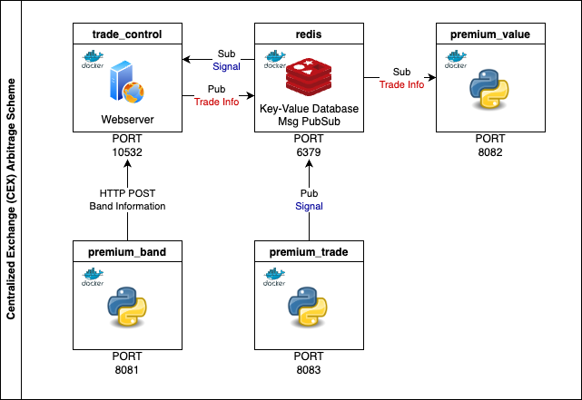

# Centralized Exchange (CEX) Arbitrage

## 1. Arbitrage container scheme.


Each of the title suggest the name of the container that's already written in `docker-compose.yaml` file, with its respective internal access ports. <b>Redis</b> database works as message queue handler that connects trade_control webserver(written with <b>Go</b>) and other premium containers. 

Checkout this [changelog](./changelog/version.md) to see the details for each versions.

## 2. Start up process. 
```console
$ docker-compose up -d
```
Docker compose file is online. (<b>Require at least docker-compose version 2</b>). Running `docker-compose up -d` will set up 4 containers and 1 default network for you. 

If one should change the key currency trading pair, look inside `./docker` and edit each `Dockerfile` for their respective containers. 

## 3. Status 

Backend
- Green Print : OK sign
- Blue Print : Trade fail sign.
- Cyan Print : Deploy environment status.
- Yellow Print : Any sort of operation. 
- Purple Print : Warning or error. Not severe. Definitely not stopping to program. 

Python
- Bold Print : Reporting purpose
- Underline Print : Infinite Loop Run start
- Header Pring (Purple) : All CexManagerX, CexManagerT Function Order.
- Green Print : OK sign
- Blue Print : OK sign. But Not leading to trade. 
- Cyan Print : OK sign - on Not Exchange Modules. (Signals)
- Warning Print (Orange) : Unfavorable condition. But Continue. 
- Fail Print (Red) : Outright Fail!

## 4. File Scheme
<details>
<summary>File Tree</summary>

```
├── README.md
├── cex
│   ├── __init__.py
│   ├── binance.py
│   ├── binance_future.py
│   ├── binance_future_trade.py
│   ├── cex_factory.py
│   ├── cex_factory_trade.py
│   ├── domestic.py
│   ├── domestic_trade.py
│   ├── ws_binance.py
│   └── ws_upbit.py
├── changelog
│   ├── old
│   │   ├── prev_back_changelog.md
│   │   └── prev_py_changelog.md
│   └── version.md
├── docker
│   ├── premium_backend
│   │   └── Dockerfile
│   ├── premium_band
│   │   └── Dockerfile
│   ├── premium_trade
│   │   └── Dockerfile
│   └── premium_value
│       └── Dockerfile
├── docker-compose.yml
├── exchange.yaml
├── exchange_example.yaml
├── exec_band.py
├── exec_pair_multi.py
├── exec_trader.py
├── kp-backend
│   ├── Config.yaml
│   ├── README.md
│   ├── Redis.yaml
│   ├── Redis_deploy.yaml
│   ├── Telegram.yaml
│   ├── api
│   │   ├── handler.go
│   │   └── server.go
│   ├── common
│   │   ├── coloring.go
│   │   ├── constant.go
│   │   ├── cors.go
│   │   ├── healthcheck.go
│   │   └── param.go
│   ├── config_deploy.yaml
│   ├── config_dev.yaml
│   ├── dao
│   │   ├── redis_conn.go
│   │   ├── redis_conn_test.go
│   │   ├── redis_crud.go
│   │   ├── redis_crud_test.go
│   │   ├── redis_pubsub.go
│   │   └── redis_structure.go
│   ├── docs
│   │   ├── docs.go
│   │   ├── swagger.json
│   │   └── swagger.yaml
│   ├── ent
│   │   ├── client.go
│   │   ├── config.go
│   │   ├── context.go
│   │   ├── ent.go
│   │   ├── enttest
│   │   │   └── enttest.go
│   │   ├── generate.go
│   │   ├── hook
│   │   │   └── hook.go
│   │   ├── migrate
│   │   │   ├── migrate.go
│   │   │   └── schema.go
│   │   ├── mutation.go
│   │   ├── predicate
│   │   │   └── predicate.go
│   │   ├── profit
│   │   │   ├── profit.go
│   │   │   └── where.go
│   │   ├── profit.go
│   │   ├── profit_create.go
│   │   ├── profit_delete.go
│   │   ├── profit_query.go
│   │   ├── profit_update.go
│   │   ├── runtime
│   │   │   └── runtime.go
│   │   ├── runtime.go
│   │   ├── schema
│   │   │   ├── profit.go
│   │   │   └── tradelog.go
│   │   ├── tradelog
│   │   │   ├── tradelog.go
│   │   │   └── where.go
│   │   ├── tradelog.go
│   │   ├── tradelog_create.go
│   │   ├── tradelog_delete.go
│   │   ├── tradelog_query.go
│   │   ├── tradelog_update.go
│   │   └── tx.go
│   ├── go.mod
│   ├── go.sum
│   ├── main.go
│   └── tg
│       ├── constant.py.go
│       └── telegram.go
├── public
│   └── Cex-Arb_Diagram.drawio.png
├── requirements.txt
├── sig
│   ├── __init__.py
│   ├── sig0.py
│   └── sig0_gen.py
├── trader
│   ├── __init__.py
│   └── order_process.py
└── utility
    ├── __init__.py
    ├── balance.py
    ├── bollinger.py
    ├── coloring.py
    ├── fx.py
    ├── graceful_shutdown.py
    ├── hedge.py
    └── parse_yaml.py
```
</details>